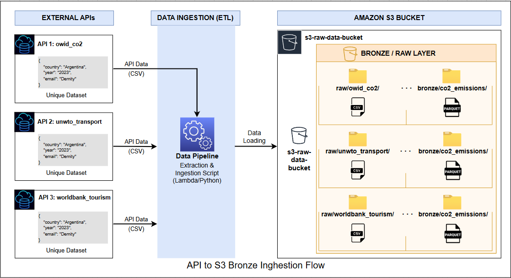

# 🥉 Bronze Layer — Pipeline de Ingesta de Datos

---

## 📌 Descripción

La **Capa Bronze** ingiere datos desde fuentes externas y los almacena en **Amazon S3 (Raw Layer)** sin transformaciones.

👉 Objetivo: preservar los datos originales como **fuente única de verdad (Single Source of Truth)**.

---

## 🧱 Arquitectura

```text
Fuentes externas
      ↓
Pipelines Bronze (Python)
      ↓
Amazon S3 (Raw - Data Lake)
```

---

## 🔧 Diagrama General

## 

---

## 🗄️ Data Lake (Raw Layer)

📍 Bucket:

```text
s3://latam-sustainability-datalake/raw/
```

---

## 📸 Evidencia real en S3

### 🌍 OWID — CO₂


---

### ✈️ UNWTO — Transport


---

### 🌴 World Bank — Tourism


---

## 📂 Estructura en S3

```text
raw/
├── owid_co2/
│   └── owid-co2-data.csv
├── worldbank_tourism/
│   ├── ST.INT.ARVL.csv
│   ├── ST.INT.RCPT.CD.csv
│   └── ST.INT.DPRT.csv
└── unwto_transport/
    └── unwto_transport.xlsx
```

---

## 🌐 Fuentes de datos

| Fuente     | Tipo  | Descripción            |
| ---------- | ----- | ---------------------- |
| OWID       | CSV   | Emisiones CO₂ globales |
| World Bank | CSV   | Indicadores turísticos |
| UNWTO      | Excel | Transporte turístico   |

---

## ⚙️ Ejecución

```bash
python run_ingestion.py
```

Modo prueba:

```bash
python run_ingestion.py --dry-run
```

---

## 🔄 Qué hace el pipeline

- Extrae datos de APIs / archivos
- Filtra:
  - Países LATAM (19)
  - Años (2013–2023)

- Valida:
  - Esquema
  - Valores nulos

- Carga a S3

---

## 🧪 Validaciones

- ✔️ Columnas esperadas
- ✔️ Valores nulos
- ✔️ Países LATAM
- ✔️ Rango de años

---

## 📊 Ejemplo de ejecución

```text
[OK] OWID CO2            (16.6s)
[OK] World Bank Tourism  (20.2s)
[OK] UNWTO Transport     (12.0s)

Total: 49.0s
```

---

## 🔄 CI/CD

GitHub Actions:

- Lint → black
- Tests → pytest
- Coverage report

---

## 🛠️ Stack

- Python
- pandas
- boto3
- requests
- AWS S3
- GitHub Actions

---

## ✅ Buenas prácticas

- Datos **inmutables**
- Separación Bronze / Raw
- Pipelines modulares
- Logging estructurado
- Modo seguro (dry-run)

---

## 📈 Estado

| Componente | Estado      |
| ---------- | ----------- |
| Bronze     | ✅ Completo |
| Raw (S3)   | ✅ Completo |

---

## 👨‍💻 Equipo

- **Adrian Sosa** — Scrum Master
- **Martin Tedesco** — Data Engineer
- **Mariana Gil** — AWS Infra
- **Luis Ramón Buruato** — Bronze / Pipelines

---

## ⭐ Conclusión

> La capa Bronze garantiza datos originales, confiables y listos para su transformación en Silver.
