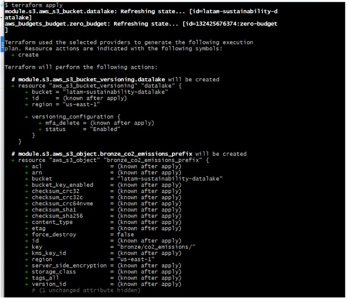
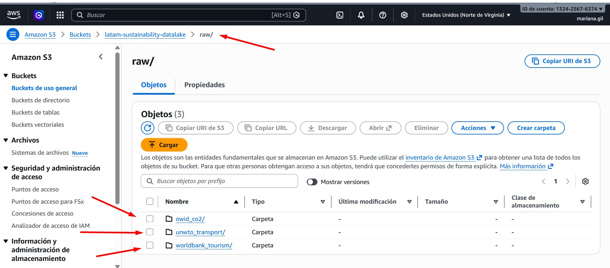
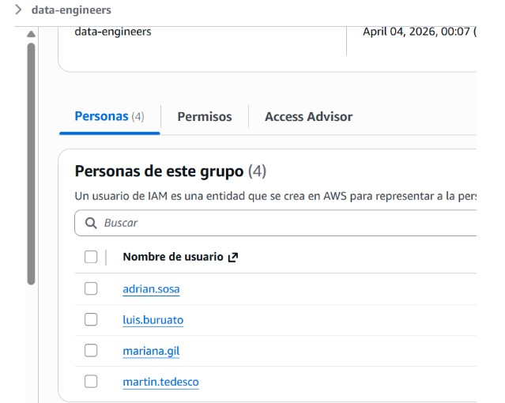
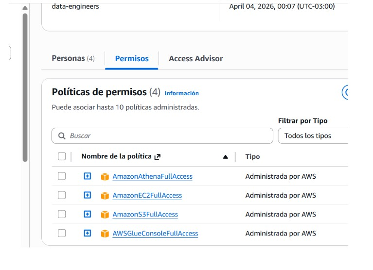
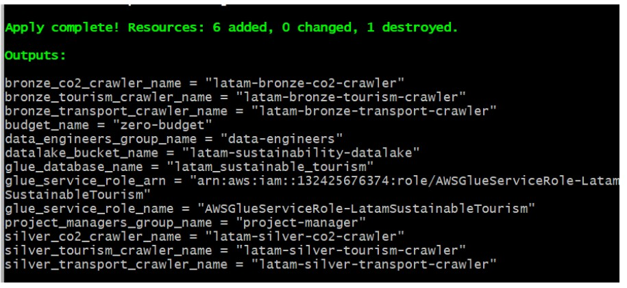
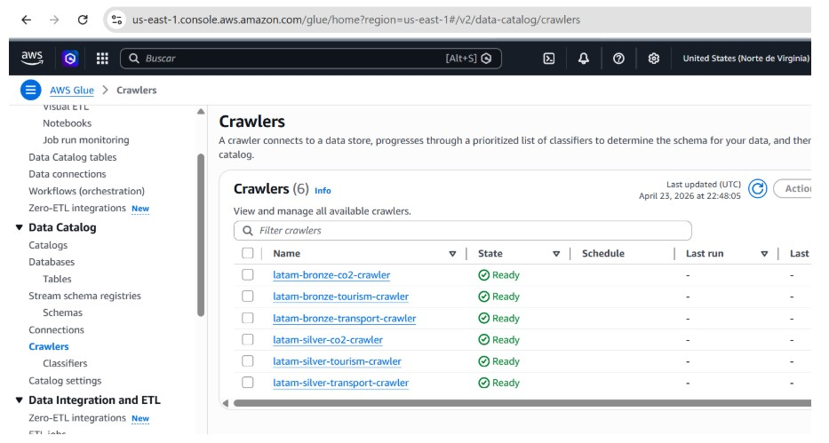
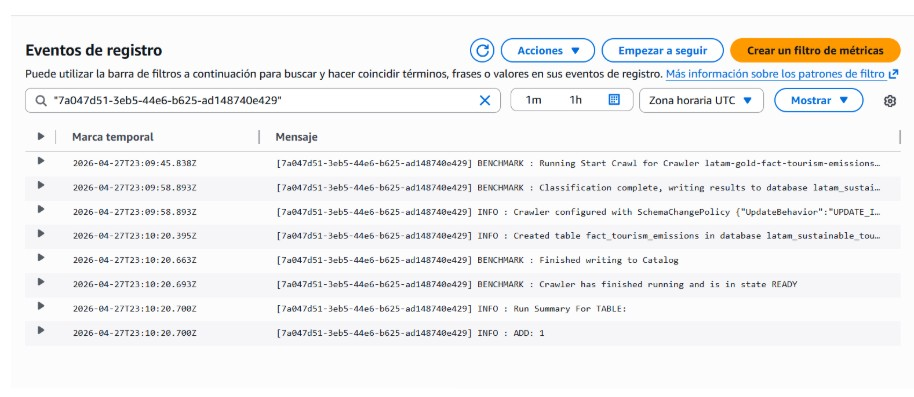
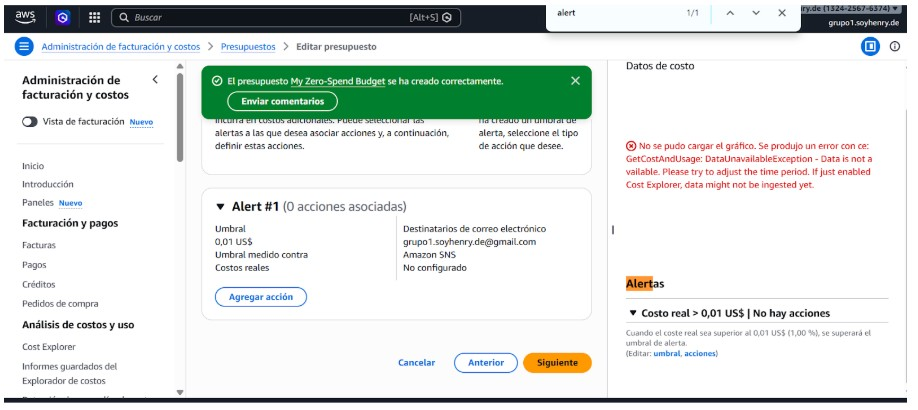

# 🏗️ Terraform — Infraestructura como Código (IaC)

---

## 1. Objetivo

Este documento describe la infraestructura gestionada con Terraform para el proyecto **Proyecto-Latam-Turismo-Sustentable**.

El alcance incluye:

* Provisionamiento de infraestructura en AWS
* Data Lake en S3 (arquitectura medallion)
* Gestión de accesos (IAM)
* Catálogo de datos (AWS Glue)
* Consultas analíticas (Athena)
* Ejecución de pipelines (EC2 + Airflow)
* Automatización (EventBridge)
* Observabilidad (CloudWatch)
* Control de costos (AWS Budget)

---

## 2. Arquitectura general

```text
Terraform
   ↓
AWS Infraestructura
   ↓
EC2 (Docker + Airflow)
   ↓
Pipelines (Bronze → Silver → Gold)
   ↓
S3 (Data Lake)
   ↓
Glue (Catálogo)
   ↓
Athena (Consultas)
   ↓
CloudWatch (Logs)
```

---

## 3. Estructura del proyecto

```bash
infra/
├── main.tf
├── variables.tf
├── terraform.tfvars
├── providers.tf
│
├── modules/
│   ├── s3/
│   ├── ec2/
│   ├── iam/
│   ├── glue/
│   └── athena/
```

---

## 4. Requisitos previos

```bash
winget install HashiCorp.Terraform
terraform version
```

```bash
cd Proyecto-Latam-Turismo-Sustentable/infra
```

---

## 5. Configuración AWS

```bash
aws sts get-caller-identity
aws configure --profile grupo1
```

* Región: `us-east-1`
* Perfil: `grupo1`

---

## 6. Flujo de trabajo Terraform

```bash
terraform init
terraform fmt -recursive
terraform validate
terraform plan
terraform apply
```

---

## 7. S3 — Data Lake

Bucket principal:

```text
latam-sustainability-datalake
```

### Estructura

```text
raw/
bronze/
silver/
gold/
```

Subcarpetas:

* `raw/owid_co2/`
* `raw/worldbank_tourism/`
* `raw/unwto_transport/`
* `bronze/co2_emissions/`
* `bronze/tourism_arrivals/`
* `bronze/transport_mode/`

👉 Implementa arquitectura **Medallion (Lakehouse)**

### 📸 Evidencia




---

## 8. IAM — Seguridad

### Grupos

* data-engineers
* project-manager

### Usuarios

* adrian.sosa
* luis.buruato
* mariana.gil
* martin.tedesco

### Permisos clave

* S3 Full Access
* EC2 Full Access
* Athena
* Glue

### 📸 Evidencia




---

## 9. AWS Glue — Catálogo

Base de datos:

```text
latam_sustainable_tourism
```

### Crawlers

#### Bronze

* latam-bronze-co2-crawler
* latam-bronze-tourism-crawler
* latam-bronze-transport-crawler

#### Silver

* latam-silver-co2-crawler
* latam-silver-tourism-crawler
* latam-silver-transport-crawler

#### Gold

* latam-gold-dim-country-crawler
* latam-gold-fact-tourism-emissions-crawler

### 📸 Evidencia




---

## 10. Athena

Workgroup:

```text
latam-sustainable-tourism
```

Permite consultas SQL sobre S3 usando Glue Data Catalog.

---

## 11. EC2 + Airflow (Pipeline Engine)

Se despliega una instancia EC2:

* Tipo: `t3.small`
* Sistema: Ubuntu
* Docker + Docker Compose
* Airflow (webserver + scheduler)

### Automatización

* Instalación automática (`user_data`)
* Clonación del repositorio
* Inicialización de Airflow

👉 La instancia ejecuta los pipelines del proyecto

---

## 12. EventBridge — Automatización

Regla configurada:

```text
cron(0 0 1 * ? *)
```

### Función

* Arranca la EC2 automáticamente el día 1 de cada mes
* Permite ejecución programada de pipelines

---

## 13. CloudWatch — Logs

Configuración:

* Log Group: `/latam-turismo/airflow`
* Streams:

  * init
  * webserver
  * scheduler

### Uso

* Centralización de logs
* Debug de pipelines
* Monitoreo

### 📸 Evidencia



---

## 14. AWS Budget

Budget:

```text
zero-budget
```

* Límite: 0.01 USD
* Notificación por email

👉 Previene costos inesperados

### 📸 Evidencia



---

## 15. Flujo de datos

```text
RAW → BRONZE → SILVER → GOLD
```

---

## 16. Validaciones

### Terraform

```bash
terraform validate
terraform plan
```

### AWS Console

* S3 ✔️
* IAM ✔️
* Glue ✔️
* Crawlers ✔️
* Athena ✔️
* EC2 ✔️

---

## 17. Verificación final

```bash
terraform plan
```

Resultado esperado:

```text
Plan: 0 to add, 0 to change, 0 to destroy
```

---

## 18. Git y CI/CD

```bash
git add .
git commit -m "update terraform"
git push origin main
```

---

## 19. Arquitectura integrada (resumen)

```text
Terraform → AWS → EC2 (Airflow) → S3 → Glue → Athena → CloudWatch
```

---

## 20. Buenas prácticas implementadas

* Infraestructura modular
* Separación por capas
* Automatización completa
* Observabilidad
* Control de costos

---

## 21. Nivel del proyecto

👉 Data Lake + Airflow + Terraform + AWS

👉 Nivel: **Data Engineer profesional**

---

## 22. Mejoras futuras

* VPC privada
* Auto scaling
* CI/CD Terraform
* Multi-entorno (dev/prod)
* Alertas CloudWatch

---


