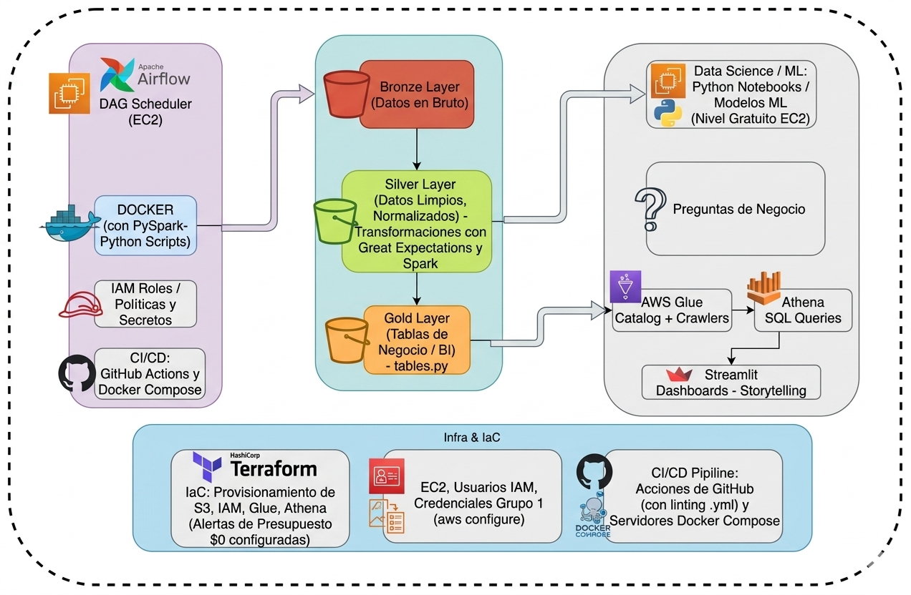

# Diseño de Arquitectura de Data Lake  
## Pipeline de Datos para Turismo y Emisiones de CO₂ en América Latina
## Introducción
El proyecto consiste en el diseño e implementación de un pipeline de datos end-to-end para analizar la relación entre el turismo y las emisiones de CO₂ en América Latina, utilizando una arquitectura de Data Lake en AWS.
Está orientado a apoyar a una organización enfocada en sostenibilidad en la comprensión del impacto ambiental del turismo y el crecimiento económico, mediante la integración y análisis de múltiples fuentes de datos.
La solución propone una arquitectura escalable, flexible y eficiente en costos, que permite la generación de indicadores clave (KPIs) y la obtención de insights para la toma de decisiones, bajo un enfoque **zero-budget** basado en servicios cloud de pago por uso.

## Arquitectura

La solución se basa en un Data Lake implementado en Amazon S3 bajo un enfoque Medallion:

- **Bronze:** datos crudos  
- **Silver:** datos limpios y estructurados  
- **Gold:** KPIs listos para análisis  

### Flujo del sistema

APIs → Amazon S3 → AWS Glue → Procesamiento (Pandas) → Amazon Athena → Dashboard (Streamlit)

### Diagrama de Arquitectura

El siguiente diagrama representa la arquitectura general del pipeline:

## Modelo de Datos

El siguiente diagrama representa el modelo conceptual de datos, mostrando las principales entidades, atributos y relaciones utilizadas en el análisis de turismo y emisiones de CO₂.

## Tecnologías Clave

- Amazon S3: almacenamiento escalable (Data Lake)  
- Amazon Athena: consultas SQL serverless  
- Apache Airflow: orquestación del pipeline  
- AWS Glue: procesamiento y catalogación de datos  
- Terraform: infraestructura como código  
- Streamlit: visualización de datos  

## Ventajas de AWS

El uso de AWS aporta beneficios clave frente a otras alternativas:

- Escalabilidad sin rediseñar la arquitectura  
- Modelo serverless que elimina la gestión de infraestructura  
- Optimización de costos mediante pago por uso  
- Alta disponibilidad y resiliencia  
- Integración con un ecosistema completo de servicios  

Adicionalmente, la arquitectura fue diseñada bajo un enfoque de **zero-budget**, permitiendo operar sin costos fijos significativos.

## Decisiones Tecnológicas (Trade-offs)

- Pandas sobre PySpark: simplicidad y rapidez para volúmenes moderados  
- Athena sobre Redshift: menor costo y enfoque serverless  
- S3 sobre bases de datos: mayor flexibilidad y escalabilidad  
- Airflow sobre scripts manuales: automatización y monitoreo  
- Terraform sobre configuración manual: reproducibilidad  
- Streamlit sobre BI tradicional: flexibilidad y menor dependencia  

## Seguridad

- Uso de IAM bajo el principio de mínimo privilegio  
- Control de accesos a recursos  
- Buenas prácticas en manejo de credenciales  

## Organización del Equipo
El proyecto es desarrollado por un equipo de cuatro integrantes bajo un enfoque colaborativo, donde todos pueden participar en cualquier etapa del pipeline.

### Áreas de trabajo

- **Ingesta de datos:** extracción desde APIs  
- **Transformación (Bronze → Silver):** limpieza y estructuración  
- **Modelado (Gold y KPIs):** generación de métricas  
- **Infraestructura y orquestación:** automatización del pipeline  

### Enfoque de trabajo

- Participación transversal del equipo  
- Colaboración continua  
- Transferencia de conocimiento  
- Adaptabilidad y mejora continua  

> Este enfoque colaborativo asegura la robustez del sistema, la transferencia de conocimiento y la escalabilidad en entornos de ingeniería de datos.

## Conclusión

La solución propuesta prioriza simplicidad, eficiencia en costos y escalabilidad. La arquitectura permite evolucionar hacia herramientas más avanzadas como PySpark, Amazon Redshift o dbt conforme crezcan los requerimientos del negocio y el volumen de datos.
