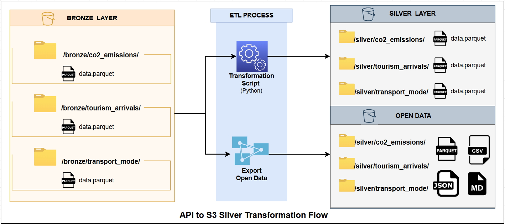

# 🌎 LATAM Sustainable Tourism — Capa Silver

## 📌 Descripción

Este repositorio contiene las transformaciones de la **capa Silver** del _Data Lake de Turismo Sostenible en LATAM_.

La capa Silver tiene como objetivo:

- Limpiar y estandarizar los datos provenientes de Bronze
- Aplicar reglas de calidad de datos
- Enriquecer datasets con métricas derivadas
- Generar datasets listos para análisis (Power BI, Gold, Open Data)

---

## 🏗️ Arquitectura

```text
Bronze (datos crudos)
   ↓
Silver (limpios, validados, enriquecidos)  ← ESTE PROYECTO
   ↓
Gold (modelos de negocio) [pendiente]
```

---

## 🔧 Diagrama General

## 

---

## 📂 Datasets procesados

| Dataset            | Fuente            | Descripción                                         |
| ------------------ | ----------------- | --------------------------------------------------- |
| `co2_emissions`    | Our World in Data | Emisiones CO₂, PIB, población, métricas ambientales |
| `tourism_arrivals` | World Bank API    | Llegadas, ingresos y salidas de turistas            |
| `transport_mode`   | UNWTO             | Llegadas por tipo de transporte (aire, mar, tierra) |

---

## ⚙️ Configuración

Toda la configuración está centralizada en:

```text
config_silver.py
```

Incluye:

- Paths en S3 (Bronze y Silver)
- Esquemas esperados por dataset
- Reglas de calidad
- Claves de deduplicación
- Países LATAM válidos
- Rango temporal (2013–2023)

---

## 🔄 Transformaciones

### 1. CO₂ Emissions

Script:

**Transformaciones:**

- Validación de esquema y tipos
- Eliminación de duplicados (`country_code`, `year`)
- Eliminación de filas sin datos relevantes
- Relleno de datos:
  - Forward-fill → población
  - Interpolación → PIB

- Métricas derivadas:
  - CO₂ per cápita
  - Intensidad de CO₂ por PIB
  - PIB per cápita
  - Crecimiento del PIB (%)

---

### 2. Tourism

Script:

**Transformaciones:**

- Validación de esquema
- Eliminación de duplicados
- Eliminación de filas sin llegadas
- Métricas derivadas:
  - Crecimiento de turistas (%)
  - Ingreso por turista

⚠️ No se realiza interpolación para evitar inventar datos financieros.

---

### 3. Transport Mode

Script:

**Transformaciones:**

- Validación de esquema
- Eliminación de duplicados
- Eliminación de filas sin datos de transporte
- Re-cálculo de:
  - Total de turistas
  - Porcentajes por tipo de transporte

- Nueva variable:
  - `dominant_transport`

⚠️ Dataset con cobertura parcial por diseño.

---

## 🧰 Utilidades compartidas

Módulo:

Funciones principales:

- Lectura desde S3 y local
- Escritura en formato Parquet (Snappy)
- Aplicación de esquemas
- Deduplicación
- Manejo de valores nulos
- Generación de reportes de calidad

---

## 📊 Calidad de datos

Cada transformación genera un **reporte de calidad** con:

- Filas antes vs después
- % de valores nulos por columna
- Países faltantes
- Años faltantes
- Alertas por umbrales definidos

Ubicación:

```text
s3://<bucket>/quality_reports/silver/
```

---

## 🚀 Orquestador

Script principal:

```text
run_transformation.py
```

Permite ejecutar todos los datasets o uno específico.

### Ejemplos

Ejecutar todo:

```bash
python run_transformation.py
```

Ejecutar uno:

```bash
python run_transformation.py --source co2
```

Modo prueba (sin S3):

```bash
python run_transformation.py --dry-run \
  --local-bronze-co2 data/bronze/co2_emissions
```

---

## 📤 Exportación Open Data

Script:

Exporta los datasets Silver a:

```text
s3://<bucket>/open-data/v1/silver/
```

Formatos:

- Parquet (análisis)
- CSV (uso público)

Incluye:

- `metadata.json`
- `data_dictionary.md`

---

## 📁 Estructura de salida

```text
silver/
  co2_emissions/
    data.parquet
  tourism_arrivals/
    data.parquet
  transport_mode/
    data.parquet
```

---

## ⚠️ Detección de Outliers (Fase Futura)

### Implementado
- Script: `detect_outliers.py`
- Método: IQR (Interquartile Range) con multiplier 1.5
- Detecta valores fuera de [Q1 - 1.5×IQR, Q3 + 1.5×IQR]

### Por qué NO se eliminan
1. Eventos reales (COVID-19, crisis políticas)
2. Preservar información histórica
3. Decisión de negocio de la ONG

### Próximas fases
- [ ] Integración S3 completa
- [ ] Reportes automáticos en Airflow
- [ ] Revisión manual y marcado (keep/remove)
- [ ] Modelado predictivo con outliers etiquetados

### Ejecutar
```bash
python detect_outliers.py --dataset co2_emissions --dry-run
```

---

## 🧪 Desarrollo local

El proyecto soporta ejecución en modo **dry-run**:

```text
data/
  bronze/
  silver/
  quality_reports/
```

Permite probar sin necesidad de S3.

---

## 📌 Decisiones de diseño

- No se particiona Silver (datasets pequeños)
- Validación estricta de esquema
- No se inventan datos (principio clave)
- Transformaciones específicas por dataset
- Preparado para escalar a Gold

---

## ⚠️ Limitaciones

- Dataset de transporte incompleto por naturaleza
- Algunos países o años pueden faltar
- Capa Gold aún no implementada

---

## 🔮 Próximos pasos

- Construcción de capa Gold
- Integración con Power BI
- Automatización (Airflow / AWS Step Functions)
- CI/CD para validación de datos

---

## 👨‍💻 Autor

Proyecto LATAM Sustainable Tourism
Data Engineering — 2026

---

## ⭐ Conclusión

La capa Silver convierte datos crudos en:

> **Datasets limpios, confiables y listos para análisis sobre turismo sostenible en LATAM**
